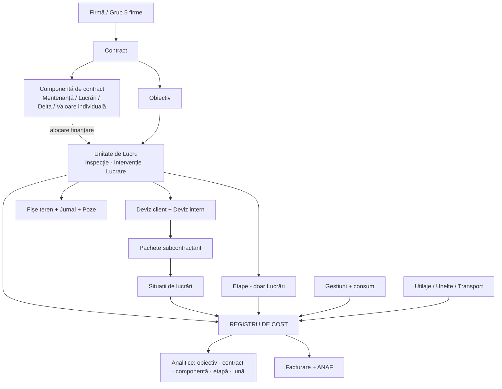

# Damina — structură cap-coadă a aplicației

Document de arhitectură funcțională. Acoperă toate cazurile descrise: 5 firme, contracte individuale, contracte de mentenanță pe 4 ani cu componentele Mentenanță / Lucrări / Delta, lucrări cu facturare inversă, inspecții, intervenții, tichete, devize, situații de lucrări, achiziții, gestiuni, utilaje, unelte, transporturi, documente și ANAF.

Structura documentului:
- **Partea I** — principiile și modelul de date (secțiunile 1–13)
- **Partea II** — fluxurile operaționale (secțiunile 14–20)
- **Partea III** — ce lipsește, ce nu va merge, fazare (secțiunile 21–24)

---

# PARTEA I — MODELUL

## 1. Cele șase principii care țin toată structura

Toate deciziile din document derivă din astea. Dacă respecți principiile, cazurile noi se așază singure; dacă le încalci, fiecare excepție cere cod nou.

**P1. Trei obiecte de lucru, nu cinci fluxuri.** Toată munca firmei e Inspecție, Intervenție sau Lucrare. Restul (mentenanță, Delta, contract individual, apartament) nu sunt tipuri de muncă — sunt *moduri de finanțare* și *moduri de stabilire a prețului*. Le separi pe axe diferite.

**P2. Finanțarea e o legătură, nu o proprietate.** O Unitate de Lucru nu „este pe Delta". Ea *e alocată* unei componente de contract, printr-un record separat, cu istoric. De-aia mutările (intervenție → Delta → contract individual) sunt o re-alocare, nu o rescriere, și de-aia o lucrare mare poate fi finanțată din trei luni de Delta simultan.

**P3. Un singur registru de cost.** Fiecare leu cheltuit — material, om, subcontractant, utilaj, motorină, transport — produce o linie într-o singură tabelă, cu aceleași dimensiuni. Toate rapoartele pe care le vrei (pe obiectiv, pe contract, pe componentă, pe etapă, pe lună) sunt filtre pe tabela asta. Nu construi rapoarte separate pe surse separate.

**P4. Venitul și costul se urmăresc separat, cu reguli explicite.** La contractele de mentenanță venitul e fix și nealocabil natural pe activități. Deci: *plafoanele* (mă încadrez?) și *marja* (fac bani?) sunt două vederi diferite, calculate diferit. Amestecarea lor e sursa clasică de rapoarte care nu se potrivesc între ele.

**P5. Stocul stă unde stă marfa fizic; contractul e o dimensiune pe document.** Nu crea gestiuni logice („gestiunea de mentenanță a contractului X"). Creezi gestiuni doar unde marfa chiar se află fizic. Apartenența la contract se pune pe documentul de consum. Altfel ajungi la sute de gestiuni de reconciliat.

**P6. Angajamentul se urmărește înaintea cheltuielii.** O comandă lansată e bani cheltuiți, chiar dacă factura vine peste 3 săptămâni. Fără stratul „angajat", controlul de buget te anunță prea târziu — mai ales cu lead-time de 2 săptămâni la Kerakoll.

---

## 2. Harta pe straturi



---

## 3. Stratul organizațional — cele 5 firme

**Entități:** `Firmă` (CUI, serii de documente proprii, credențiale SPV proprii, gestiuni proprii), `Grup`.

**Comun între firme:** nomenclator de produse, furnizori, subcontractanți, clienți, obiective (o clădire poate fi pe contracte ale mai multor firme), catalog de operațiuni, șabloane de deviz, șabloane de PV.

**Separat per firmă:** contracte, comenzi, facturi, gestiuni, situații de lucrări, serii și numere de documente, raportare ANAF.

**Ce ai omis și e obligatoriu: intercompany.** Ai spus că firmele facturează între ele. Asta cere:
- Marcarea explicită a unei tranzacții ca intercompany (client = firmă din grup).
- Transferul de marfă între gestiuni ale unor firme diferite **nu e transfer, e vânzare** — cu aviz, factură, NIR la destinație. Sistemul trebuie să genereze automat perechea de documente.
- **Eliminarea la consolidare.** Fără asta, marja pe grup e umflată artificial: venitul firmei A și costul firmei B sunt același leu. Vederea „toate firmele" trebuie să aibă un comutator brut/consolidat.

**Selector de firmă:** una, mai multe, sau toate. Toate rapoartele respectă selecția. Recomand ca vederea consolidată să fie explicit etichetată „consolidat (fără intercompany)" ca să nu comparați mere cu pere.

---

## 4. Contract și plafoane — motorul de bani

### 4.1 Contract

| Câmp | Observații |
|---|---|
| Firmă, client, cod, referință | serie proprie per firmă |
| Tip | `Mentenanță multianual` / `Individual cu deviz` / `Individual cu facturare inversă` |
| Perioadă (start, sfârșit) | la mentenanță: 4 ani |
| Valoare totală, valoare lunară | la mentenanță: abonament = valoare / nr. luni |
| Termen de plată | 70 zile — intră în calculul de cash-flow |
| Clauză de indexare | **lipsește din descrierea ta — vezi §22.6** |
| Alertă expirare | prag configurabil (recomand 6 luni) |
| Prag mentenanță → Delta | ai spus 2000 lei; fă-l configurabil per contract |

### 4.2 Componente de contract

Aici e cheia. Un contract are 1..n componente. Fiecare componentă are **trei numere separate**, care azi sunt amestecate în capul tuturor:

| Număr | Ce înseamnă | Exemplu (contract 1 mil.) |
|---|---|---|
| **Venit alocat** | ce parte din abonament „aparține" componentei | Mentenanță 40% = 400.000 |
| **Plafon de cost** | cât ai voie să cheltui ca să fii profitabil | 300.000 (marjă țintă 25%) |
| **Consum real** | cât s-a cheltuit efectiv, live | calculat din registrul de cost |

Tipuri de componente:

| Tip | Are deviz? | Logica de control | Ce urmărești |
|---|---|---|---|
| **Mentenanță** | nu | plafon de cost lunar | să NU depășești |
| **Lucrări** | da, per lucrare | plafon de cost anual + buget per lucrare | să NU depășești |
| **Delta** | da, deviz mic per lucrare | plafon de **venit** lunar (15% din abonament) | să **UMPLI** |
| **Individual** | da | valoarea contractului | marjă |

**Delta e inversul celorlalte** și de-aia e ușor de modelat greșit. La Mentenanță și Lucrări controlezi ca să nu treci peste. La Delta te chinui să ajungi la plafon, pentru că neumplut înseamnă venit pierdut fără cost. Interfața trebuie să reflecte asta: un „gauge" care se umple, nu unul care se golește.

**Bugetare temporală:** plafoanele au granularitate lunară pentru Mentenanță și Delta, anuală pentru Lucrări (cu defalcare lunară planificată la începutul anului). Sistemul ține: `plan lunar`, `angajat`, `consumat`, `rest`, `proiecție la final de an`.

### 4.3 Ce vezi live pe contract

Un singur ecran per contract, per lună:

```
Contract 4700 / Apa Nova            August 2026        [◀ ▶]
─────────────────────────────────────────────────────────────
Abonament lunar                                    83.333 lei
─────────────────────────────────────────────────────────────
MENTENANȚĂ    venit 33.333 · plafon cost 25.000
              angajat 4.200 · consumat 18.100 · rest 2.700   ▓▓▓▓▓▓▓▓▓░  89%
LUCRĂRI       venit 50.000 · plafon cost 37.500
              3 lucrări active · consumat 31.900 · rest 5.600 ▓▓▓▓▓▓▓▓░░  85%
DELTA         plafon venit 12.500 · umplut 8.400 · liber 4.100 ▓▓▓▓▓▓░░░░  67%
              ⚠ 4.100 lei neumpluți — 3 propuneri disponibile în backlog
─────────────────────────────────────────────────────────────
Marjă lună: 33.9%   ·   Marjă cumulată contract (an 2/4): 27.1%
```

---

## 5. Obiectiv

Obiectivul e clădirea, gura de canal, stația — orice loc unde se face activitate.

**Entitate `Obiectiv`:** cod, denumire, tip (clădire administrativă / stație / rezervor / gură de canal / …), adresă, coordonate GPS, suprafață, poze, documente (planuri, cartea tehnică).

**Legătura cu contractul e o entitate separată, `ContractObiectiv`:**
- perioadă de valabilitate (obiective se adaugă și se scot din contract în cei 4 ani)
- **profil de inspecție** — care checklist-uri se aplică, luat din caietul de sarcini
- frecvență contractuală de inspecție per tip

Asta rezolvă exact cazul pe care l-ai descris: *„pe același contract, la unele obiective faci alte inspecții decât la altele"*. Profilul stă pe legătură, nu pe obiectiv și nu pe contract.

**Un obiectiv poate fi pe mai multe contracte** (în timp sau simultan, la firme diferite). De-aia istoricul pe obiectiv e o vedere transversală, nu o listă de copii ai contractului.

**Ecranul „istoric obiectiv"** — ce ai cerut explicit:

```
Obiectiv: Stație pompare Berceni                      Contract 4700
──────────────────────────────────────────────────────────────────
Aug 2026  🔍 Inspecție electrică      Subc. ElectroX      412 lei
Aug 2026  🔍 Inspecție vizuală        Echipă proprie      180 lei
Aug 2026  🔧 Intervenție #1841        Echipă proprie    1.240 lei
                                       manoperă 620 · mat. 620
Iul 2026  🔍 Inspecție sanitară       Subc. HidroY        390 lei
Iun 2026  🏗 Lucrare L-233 Hidroizolație  (Delta, 3 luni)
                                       total 41.800 · luna asta 13.900
──────────────────────────────────────────────────────────────────
Total obiectiv 2026: 87.430 lei   ·   media lunară: 10.929 lei
```

---

## 6. Unitatea de Lucru (UL) — inima modelului

Trei tipuri, cu structuri diferite dar identitate comună.

| | Inspecție | Intervenție | Lucrare |
|---|---|---|---|
| Declanșator | omul din teren, când are drum | tichet / solicitare / constatare | ofertă acceptată |
| Durată tipică | ore | 1–3 zile | săptămâni–luni |
| Deviz | nu | nu (estimare din catalog) | **obligatoriu** |
| Etape | nu | nu | da |
| Jurnal de șantier | nu | nu | da |
| Fișă | fișă de inspecție (checklist) | fișă de intervenție | jurnal pe etape |
| Consum material | rar | da, pe fișă | da, prin bon de consum |
| Manoperă proprie | pontaj / tarif standard | ore declarate pe fișă | pontaj |
| Subcontractant | factură pe contract (abonament) | factură punctuală | SL lunar per pachet |
| Buget propriu | nu (tarif standard) | nu (prag) | da, + buget pe etapă |

**Câmpuri comune tuturor UL** — asta le face interschimbabile la mutări:

```
UL {
  id, cod, tip (inspecție|intervenție|lucrare)
  obiectiv_id
  firma_id
  status
  responsabil (PM / șef de șantier)
  executant (echipă proprie | subcontractant)
  data_start, data_final
  valoare_estimată, buget_cost
  --- finanțarea NU e aici, e în tabela de alocare (§13) ---
}
```

**Promovarea** — intervenție → lucrare: se schimbă `tip`, se adaugă structura de Lucrare (deviz, etape), **se păstrează id-ul, pozele, orele și consumurile deja înregistrate**. Nimic nu se rescrie. Asta e diferența dintre un sistem în care mutările sunt normale și unul în care lumea evită să mute și ține evidența în Excel.

---

## 7. Cererea — tichet, solicitare, constatare

Ai spus corect că le gândești ca etichete pe același lucru. Modelează-le așa: **o entitate `Cerere`, cu `tip` ca tag**.

```
Cerere {
  tip: tichet client | solicitare | constatare din inspecție | propunere internă
  sursă: email | telefon | portal | fișă de inspecție #
  obiectiv, contract
  descriere, poze
  valoare_estimată  ← din catalogul de operațiuni (§8.5)
  status, decizie, decis_de, decis_la
}
```

**Routing-ul deciziei** — regula pe care o aplicați azi din cap, formalizată:

```
valoare estimată < prag_mentenanță (2.000 lei)
     → Intervenție, finanțată din componenta Mentenanță

prag_mentenanță ≤ valoare ≤ plafon Delta disponibil
     → Lucrare mică, finanțată din Delta

valoare > plafon Delta lunar
     → (a) Lucrare pe componenta Lucrări, SAU
       (b) Lucrare împărțită pe 2–3 luni de Delta, SAU
       (c) Oportunitate → contract individual nou
```

Decizia se înregistrează cu autor și dată. E cea mai importantă decizie economică din firmă și acum nu lasă urmă nicăieri.

**Backlogul de propuneri.** Fiecare punct NOK dintr-o fișă de inspecție trebuie să aibă o ieșire: rezolvat pe loc / intervenție / propunere. Propunerile intră într-un backlog evaluat, care e exact combustibilul pentru umplerea Deltei. Fără asta, Delta se umple reactiv și rămâne parțial neîncasată.

---

## 8. Devizul

### 8.1 Două devize, legate

| | Deviz Client (Oferta) | Deviz Intern (al PM-ului) |
|---|---|---|
| Cine | devizist / ofertare | manager de proiect |
| Pentru | ce vede clientul | ce trebuie făcut efectiv |
| Granularitate | 5 poziții sau 500, cum cere cazul | detaliat: material, manoperă, utilaj, transport |
| Material/manoperă | uneori la comun, uneori separat | **întotdeauna separat** |
| Indirecte + profit | da, ca pachet (%) | nu — doar cost direct |

**Legătura e N:M.** O poziție din devizul client se poate sparge în 5 poziții interne; sau 3 poziții client pot corespunde uneia interne. Tabela de mapare (`poziție_client`, `poziție_internă`, `coeficient`) e ce permite ca declarația de cantitate a subcontractantului să urce automat în situația de lucrări către client.

Când devizul client e deja bine făcut, PM-ul apasă „preia ca deviz intern" și mapping-ul e 1:1.

### 8.2 Cele patru moduri de a porni un deviz

Toate produc **aceeași structură**. Sunt patru importatori, nu patru tipuri de deviz.

1. **Șablon pe tip de obiectiv** (SH, bazin, rezervor, filtru, stație) — poziții pre-normate, setezi cantitățile.
2. **Copiere din proiect anterior** — alegi o lucrare similară, se clonează devizul, ajustezi.
3. **Bibliotecă de articole normate** — articole proprii, refolosibile („montaj gresie", „montaj schelă"), fiecare cu componenta de material + manoperă + normă de timp. Se construiește în timp și e cel mai valoros activ pe termen lung.
4. **Import Excel** — pentru cazuri exotice (cântar, iluminat stradal). Template de import cu mapare de coloane.

**Recomandare:** modul 3 trebuie să fie ținta. De fiecare dată când cineva face un deviz în modurile 1, 2 sau 4, sistemul îi propune să salveze pozițiile noi ca articole în bibliotecă. Așa biblioteca crește singură, în loc să depindă de un proiect separat de „normare" care nu se face niciodată.

### 8.3 Pachete pentru subcontractanți

Din devizul intern, PM-ul selectează linii și le grupează în **pachete** (electric, sanitar, construcții). Pachetul se trimite ca cerere de ofertă către unul sau mai mulți subcontractanți.

Subcontractantul: acceptă prețul propus de tine, sau ofertează al lui, sau comentează linie cu linie. **Materialele nu intră niciodată în pachet** — regula ta e clară și trebuie impusă de sistem: subcontractanții facturează doar manoperă.

Pachetul acceptat devine baza pentru situațiile de lucrări lunare.

### 8.4 Trasabilitatea completă

```
Poziție deviz client  ←→  Poziție deviz intern  →  Linie pachet subc  →  Linie SL subc
                                      ↓
                          Necesar material → comandă → recepție → consum
```

Asta e lanțul care îți permite să răspunzi, pe orice linie: cât am ofertat, cât am estimat că mă costă, cât am comandat, cât am consumat, cât a declarat subcontractantul, cât am facturat.

### 8.5 Catalogul de operațiuni standard — pentru mentenanță

Lucrările au deviz. Mentenanța nu are, și de-aia zici că „o urmărești doar analitic". Nu e obligatoriu să fie așa.

Faceți aceleași 100–200 de tipuri de intervenții la nesfârșit. Un catalog `tip operațiune → normă de timp → materiale tipice → cost estimat` îți dă:
- **decizia mentenanță / Delta / contract în 30 de secunde, pe cifre** (pragul de 2.000 lei devine obiectiv, nu „din ochi")
- estimare instantanee pentru propunerile din inspecții → backlogul de Delta se umple singur
- comparație *consum așteptat vs consum real* per tip de intervenție și per echipă — cel mai bun mecanism anti-furt pe care îl poți avea, mai bun decât orice structură de gestiuni
- un pseudo-deviz pentru componenta de mentenanță, deci estimat vs realizat, nu doar „am consumat X din buget"

La fel pentru inspecții: timp standard per tip de obiectiv × cost/oră = cost estimat, comparabil cu factura fixă a subcontractantului.

---

## 9. Execuție — Lucrări

**Etape** (definite de PM): denumire, ordine, perioadă planificată, **buget de material**, buget de manoperă, procent din lucrare. Graficul Gantt se construiește din etape.

**Bugetul de material pe etapă** — ai cerut asta explicit. Atenție: funcționează doar dacă **fiecare linie de comandă poartă etapa**. Dacă șeful de șantier comandă „pe lucrare" fără etapă, raportul e gol. Deci: câmpul `etapă` obligatoriu pe necesarul de materiale, cu default = etapa curentă din grafic.

**Jurnal de șantier:** intrări pe etapă, cu text, poze, video. Plus o secțiune fixă **înainte / după** la nivel de lucrare, obligatorie la deschidere și la închidere.

**Pontaj:**
- oameni proprii: pe UL, cu posibilitatea de a **împărți ziua pe mai multe UL** (altfel alocarea costului e falsă — un om pe 3 șantiere într-o zi e normal la voi)
- subcontractanți: pontaj de prezență declarat de șeful de șantier (câți oameni, ce firmă) — separat de situația de lucrări, e instrument de control, nu de plată

**Tarif orar:** rate card per calificare, **istoricizat** (salariile cresc în 4 ani). Costul orei = salariu + taxe + un coeficient de neproductivitate.

---

## 10. Situațiile de lucrări — lanțul complet

### 10.1 Fluxul, așa cum l-ai gândit (e corect)

```
1. Subcontractant         declară cantități pe liniile pachetului său
                          ↓
2. Șef de șantier         vede CANTITĂȚI, NU PREȚURI
                          confirmă / corectează / comentează
                          ↓
3. Manager de proiect     vede tot, aprobă
                          ↓
4. Sistem                 generează COD SL
                          ↓
5. Subcontractant         descarcă SL (formatul tău, logo-ul lui)
                          emite factură CU codul SL
                          ↓
6. SPV → factură intră    matching automat pe cod SL
                          ↓
7a. Contract individual:  cantitățile aprobate urcă prin mapare
                          → SL către client → factură client
7b. Contract mentenanță:  se oprește la pasul 4, costul intră
                          pe componenta Lucrări. Fără SL spre client.
```

### 10.2 Ce trebuie adăugat

**Cantități cumulate pe fiecare linie:** `contractat` / `executat cumulat` / `aprobat cumulat` / `facturat cumulat` / `rest`. Sistemul blochează declararea peste cantitatea contractată fără o suplimentare aprobată. Fără asta, controlul e iluzoriu.

**Garanția de bună execuție.** Lipsește complet din descriere și e standard în construcții: reții 5–10% din fiecare SL de subcontractant, eliberezi la recepție și la expirarea garanției. Trebuie: procent per contract subc, sold de garanții reținute, scadențar de eliberare. La fel pe partea de client — și clientul îți reține ție.

**Suplimentări / lucrări neprevăzute:** linie nouă pe SL, marcată ca suplimentare, cu aprobare separată. Se întâmplă mereu; dacă nu e modelat, oamenii o vor „ascunde" în cantități umflate pe liniile existente.

**Intrare din spate:** ai cerut-o. Facturi de subcontractant fără SL în sistem (istorice, sau prestații mici) — se introduc direct, cu contract + componentă + UL + tip de cheltuială obligatorii. Marcate ca „fără SL" ca să vezi câte sunt. Dacă procentul e mare, fluxul nu e adoptat.

---

## 11. Registrul de cost — tabela care răspunde la tot

Aceasta e cea mai importantă decizie tehnică din tot documentul. Fiecare cheltuială, indiferent de sursă, produce una sau mai multe linii identice ca formă:

```
LinieCost {
  -- CÂND și CINE
  data_document, data_efect (luna de raportare, poate diferi)
  firma_id

  -- UNDE S-A ÎNTÂMPLAT (analitica "folosit")
  contract_folosit_id
  componenta_folosit_id
  obiectiv_id
  ul_id                     (inspecție / intervenție / lucrare)
  etapa_id                  (null, dacă nu e lucrare)

  -- CINE PLĂTEȘTE (analitica "descărcat")  ← vezi §12
  contract_descarcat_id
  componenta_descarcat_id

  -- CE FEL DE COST
  tip_cheltuiala            material | manoperă proprie | servicii subc |
                            utilaj | motorină | transport | reparații | alte
  produs_id / calificare_id (după caz)

  -- CÂT
  cantitate, um
  valoare
  stadiu                    angajat | recepționat | consumat | facturat

  -- DE UNDE VINE
  document_tip              bon consum | SL | factură | fișă motorină |
                            fișă utilaj | pontaj | fișă intervenție | comandă
  document_id
  furnizor_id / subcontractant_id
}
```

**Toate întrebările tale sunt filtre pe tabela asta:**

| Întrebare | Filtru |
|---|---|
| Cât am consumat pe componenta Mentenanță a contractului X luna asta? | `contract_descarcat=X, componenta=Mentenanță, data_efect=luna` |
| Ce s-a întâmplat pe obiectivul Y în 2026? | `obiectiv=Y, an=2026`, grupat pe UL |
| Cât m-a costat intervenția #1841? | `ul_id=1841` |
| Materiale pe etapa 2 a lucrării L-233? | `ul=L-233, etapa=2, tip=material` |
| Cât am angajat dar încă n-am consumat? | `stadiu=angajat` |
| Costurile directe totale pe contractul Z? | `contract_descarcat=Z` |

**`data_efect` separat de `data_document`** rezolvă cazul pe care l-ai menționat: o fișă se face în iulie dar se raportează în august. Documentul rămâne datat corect, raportul îl ia în luna aleasă. Odată ce luna e închisă, `data_efect` nu se mai poate schimba în ea.

---

## 12. Dubla analitică — „folosit" vs „descărcat"

Ai cerut-o explicit: *„să pot pune și contractul pentru care s-a folosit materialul, dar și contractul pe care se descarcă de fapt"*. E o cerință corectă și mai rară decât crezi — merită construită de la început, pentru că retro-fitting-ul e dureros.

**Regula:**
- **Folosit** = unde s-a întâmplat fizic munca. Alimentează istoricul pe obiectiv și raportul către client.
- **Descărcat** = pe ce buget se duce banul. Alimentează plafoanele, marja și controlul financiar.
- Implicit sunt egale. Diferă doar când cineva le desparte explicit, cu motiv obligatoriu și aprobare.

**Consecință importantă pentru rapoarte:** trebuie să fie clar, pe fiecare ecran, pe care dintre cele două analitice e construit. Recomand:
- Ecranul de contract / plafoane / marjă → **descărcat**
- Istoricul obiectivului și raportul lunar către client → **folosit**
- Un raport de reconciliere care listează toate liniile unde cele două diferă. Dacă lista crește necontrolat, ceva e în neregulă în firmă, nu în software.

---

## 13. Alocarea de finanțare și mutările

Tabela care rezolvă simultan Delta pe mai multe luni, mutările între contracte și promovările.

```
AlocareFinantare {
  ul_id
  contract_id, componenta_id
  perioada (luna/anul)
  valoare_alocata      -- suma din UL finanțată din această componentă/lună
  procent              -- alternativ
  status               activ | înlocuit
  motiv, creat_de, creat_la
}
```

**Cazurile tale, rezolvate:**

| Caz | Cum arată |
|---|---|
| Lucrare mică pe Delta, o lună | 1 alocare: Delta, august, 8.400 lei |
| Lucrare mare împărțită pe 3 Delta | 3 alocări: aug 12.500 · sep 12.500 · oct 9.800 |
| Intervenție care devine lucrare pe Delta | alocarea Mentenanță se închide, se deschide alocare Delta; UL își schimbă tipul |
| Lucrare mutată de pe mentenanță pe contract individual | alocare nouă pe contractul individual; UL rămâne același |
| Lucrare pe 2 contracte simultan | 2 alocări paralele cu procente |

**Regula de aur la mutare:** costurile deja înregistrate **rămân în luna în care s-au produs** (nu rescrii istoria contabilă), dar `contract_descarcat` se recalculează printr-un document de re-alocare, cu autor, motiv și dată. Dacă luna e închisă, re-alocarea se face în luna curentă ca ajustare vizibilă, nu retroactiv în tăcere.

---

# PARTEA II — FLUXURILE

## 14. Fluxul de contractare / ofertare

```
SURSE                    →  PÂLNIE UNICĂ  →  DECIZIE
─────────────────────────────────────────────────────────────
Solicitare client ─┐
Tichet escaladat  ─┼→  Cerere → Constatare la fața locului
Constatare din    ─┘        (operațiuni, poze, notițe,
inspecție                    suprafețe, materiale)
                                 ↓
                    Cerere de ofertă către subcontractanți
                    (electric, sanitar — pe specialitate)
                                 ↓
                    Constatatorul compilează
                                 ↓
                    Ofertare: adaugă indirecte + profit
                                 ↓
                    Ofertă către client
                                 ↓
                    ┌────────────┴────────────┐
              Acceptată                  Respinsă / Amânată
                    ↓                          ↓
        Alocare de finanțare:            rămâne în backlog,
        Mentenanță / Delta /             re-evaluabilă când
        Lucrări / Contract nou           se caută umplere Delta
                    ↓
              Se creează UL
```

**Ce lipsește azi:** ramura „respinsă/amânată" nu duce nicăieri. Toate constatările care nu s-au transformat imediat în lucrare sunt bani lăsați pe masă, mai ales când ai Delta de umplut lunar. Backlogul evaluat este funcționalitatea cu cel mai bun raport efort/venit din tot proiectul.

## 15. Fluxul de execuție

**Lucrare:** PM primește lucrarea aprobată → face devizul intern → definește etape și grafic → creează pachete și alege subcontractanți → desemnează șef de șantier → șeful de șantier ține jurnalul, comandă materiale/utilaje/unelte/transport pe etape → SL lunare → închidere.

**Intervenție:** cerere → asignare (echipă proprie sau subcontractant) → deplasare → fișă de intervenție (poze, descriere, materiale consumate, ore) → validare → intră în raportul lunii.

**Inspecție:** omul creează inspecția când are drum → alege obiectivul → sistemul încarcă checklist-ul din profilul obiectivului → bifează, notează probleme, poze → la probleme: buton „creează nevoie de intervenție" → fișa se închide și intră în raport.

**Închiderea unei Lucrări** — pas pe care nu l-ai descris, dar e necesar: ajustare stoc rămas pe gestiunea șantierului, retur la magazie, ultimul bon de consum, PV de recepție, blocarea de noi costuri, calculul marjei finale, arhivarea în „proiecte anterioare" ca sursă de copiere pentru devize viitoare.

## 16. Achiziții — trei canale

Instinctul tău (magazia face tot) e **corect pentru mentenanță și greșit pentru lucrări**. Motivele tale — urgență, Glina lângă magazie, fluctuație de personal, retururi de reciclat, magazionerii știu substituțiile — se aplică toate la muncă neplanificabilă. La o lucrare cu deviz aprobat, necesarul e cunoscut cu săptămâni înainte; ruta prin magazie adaugă un hop și ascunde comanda de controlul de buget.

Împarte pe **canale**, nu pe departamente:

| | Canal A — Replenishment | Canal B — Urgență mentenanță | Canal C — Aprovizionare lucrare |
|---|---|---|---|
| Owner | Achiziții | Magazie, cap-coadă | Achiziții, aprobare PM |
| Declanșator | min/max din consum istoric | cerere din teren | necesar din deviz, eșalonat pe etape |
| Sursă | contracte cadru, consignație | stoc / consignație / cumpărare rapidă | comandă la furnizor |
| Livrare | magazie | direct la echipă | direct în șantier (sau magazie → șantier) |
| Control | stoc de siguranță | prag valoric + listă furnizori pre-aprobați | **blocaj pe bugetul lucrării** |
| Prioritate | cost | viteză | termen + cost |

**Pasul care vă păstrează avantajul:** pe Canal C, fiecare linie trece printr-un filtru de 24h la magazie — *„pot acoperi din stoc sau din retururi?"*. După 24h curge automat la achiziții. Magazionerii își păstrează rolul de filtru și cunoașterea substituțiilor, dar nu mai sunt gât de sticlă. Retururile devin vizibile ca stoc disponibil **înainte** să se emită PO pe același articol.

**Rolul real al omului de achiziții** nu e să dea comenzi (aia e muncă de operare). E: contracte cadru, prețuri negociate, furnizori alternativi și **managementul lead-time-ului**. Kerakoll la 2 săptămâni e o problemă de achiziții, nu de magazie.

**Fluxul PO standard:**
```
Necesar (din deviz sau din teren)
   → Cerere de ofertă la furnizori (produsele au deja furnizori și prețuri)
   → Comparare oferte
   → PO cu distribuție analitică pe linie (contract + componentă + UL + etapă)
   → Confirmare furnizor + termen
   → Recepție (aviz încărcat din teren) → NIR
   → Factura din SPV → matching automat 3-way (PO ↔ recepție ↔ factură)
   → Diferențe → coadă de rezolvat
```

**Alertă la 80% consum din cantitatea de deviz**, nu la 100%. Cu 2 săptămâni lead time, diferența dintre a afla la 80% și la 100% e diferența dintre a comanda la timp și a bloca șantierul.

**Măsurați estimat vs consumat per articol per lucrare** și dați feedback-ul înapoi la echipa de constatare. Altfel compensați la nesfârșit estimările slabe cu stoc tampon, adică cu bani blocați.

## 17. Gestiuni — structura recomandată

Ai cerut soluție aici. Regula: **gestiune = loc fizic unde stă marfa**. Apartenența la contract se pune pe documentul de consum, nu prin crearea unei gestiuni.

| Gestiune | Câte | Ce ține | Proprietar juridic |
|---|---|---|---|
| Magazie centrală | 1 / firmă | stoc standard, retururi | firma |
| Consignație furnizor | 1 / furnizor | electrice, sanitare, consumabile | **furnizorul** (custodie) |
| Șantier / Lucrare | 1 / lucrare activă | material livrat pe șantier | firma |
| Echipă / mașină | 1 / echipă (**nu per om**) | material pentru intervenții | firma |
| Subcontractant | 1 / subcontractant | material predat lor | firma (custodie la terț) |
| Unelte | 1 / firmă + sub-locații | unelte, cu status | firma |
| Utilaje | registru de active | utilaje, locație = șantier curent | firma / închiriat |

**Nu creați „gestiune de mentenanță a contractului".** Materialul iese din magazie → gestiune echipă (transfer) → se consumă pe fișa de intervenție, iar fișa poartă contractul, componenta și obiectivul. Contractul e o dimensiune de cost, nu un depozit. Cu 9 contracte × 700 obiective, gestiunile logice devin imposibil de inventariat.

**Zona de rezervare:** pe gestiunea magaziei, cantitățile rezervate pentru o lucrare sunt marcate, nu mutate. Stocul disponibil = fizic − rezervat. Rezervarea are termen de expirare, altfel se acumulează rezervări moarte.

**Documente:** NIR, aviz de transfer, bon de consum, aviz de retur, PV de custodie, listă de inventar, decizie de inventariere, notă de diferențe. Serii și numere per firmă și per gestiune.

**Loturi și expirare:** obligatoriu pe adezivi, mortare, chimicale (Kerakoll). Alertă cu prag configurabil, FEFO la eliberare.

**WMS:** raft/locație, coduri de bare, scanare la recepție și la eliberare, inventar prin scanare, min/max cu forecast pe consum istoric. Recomand ca WMS-ul complet să fie **faza 3**, nu faza 1 — la început e suficient stoc pe gestiune cu cantități și cost mediu ponderat.

**Cost la consum:** cost mediu ponderat (CMP), calculat per gestiune. Trebuie să fie aceeași metodă ca în contabilitate, altfel nu se potrivesc niciodată.

## 18. Utilaje, unelte, transporturi

**Utilaje** — registru de active, cu: rezervare pe calendar (perioadă, șantier), PV de predare-primire cu poze, fișă de motorină (litri → cost pe lucrare), **fișă zilnică de ore de funcționare** → cost orar × ore = cost pe lucrare, fișe de reparație cu factură atașată, status, contor ore/km, expirări (ITP, RCA, ISCIR), observații.

Notă: un utilaj propriu are cost real doar dacă îi atribui un **tarif orar intern** (amortizare + reparații + asigurări / ore anuale). Altfel „costul cu utilajul" pe lucrare e doar motorina, ceea ce subestimează. Recomand tarif orar intern per utilaj, revizuit anual.

**Unelte** — se comportă ca produsele: necesar, comandă, predare cu PV, retur cu PV și constatare stare, gestiune, status (activ / la reparații / casat), istoric per unealtă și per om.

**Transporturi** — o singură entitate `Transport` cu tipuri:

| Tip | Declanșator |
|---|---|
| Livrare material la șantier | automat din comandă/livrare |
| Transfer între șantiere | cerere șef de șantier |
| Retur material la magazie | din documentul de retur |
| Evacuare moloz / deșeuri | cerere șef de șantier |
| Transport utilaj | din rezervarea de utilaj |

Toate ajung în **aceeași coadă centrală**, cu vedere pe zi și hartă. Cele generate automat (din comenzi, din rezervări de utilaje) intră singure — asta e diferența dintre o listă de cereri și o planificare reală de transport.

**Lipsă importantă: evacuarea de moloz e deșeu reglementat.** Ai nevoie de evidența deșeurilor, formular de încărcare-descărcare pentru nepericuloase, bon de cântar, raportare SIATD. Nu e opțional și nu apare deloc în descriere.

## 19. Documente, PV, file management

**FMS:** foldere și subfoldere libere, plus **folder auto-generat per UL** (lucrare, intervenție, inspecție). Tot ce se încarcă din teren pe acea UL aterizează automat în folderul ei. Poți lega manual un folder existent la o UL.

Structura implicită pe lucrare: `Contract / Obiectiv / Lucrare / {Deviz, Oferte, Avize, Facturi, PV, Poze/Etapa N, Video, Before-After, Recepții}`.

**Poze:** compresie automată, thumbnail, **timestamp și geotag** (esențial pentru 700 obiective și pentru dovada că inspecția s-a făcut acolo), legare la UL + etapă + punct de checklist.

**Video:** limită de mărime și retenție, altfel costul de stocare explodează.

**Module PV:** încarci un șablon Word cu placeholder-e (`{{obiectiv}}`, `{{data}}`, `{{executant}}`, câmpuri libere de completat) → se generează → se completează pe telefon → se semnează → PDF-ul semnat se salvează în folderul UL și apare în aplicația celui care a semnat.

Tipuri de PV necesare: predare-primire utilaj, predare-primire unelte, custodie material la subcontractant, acces în locație, recepție calitativă, **recepție lucrări ascunse**, recepție la terminarea lucrărilor, inventar.

**Semnătura:** decide devreme ce fel e — desen pe ecran (valoare de probă), OTP pe SMS, sau certificat calificat. Pentru PV de recepție contează juridic.

## 20. Facturare și ANAF

**Individual cu deviz:** SL client aprobată → factură lunară, o linie, suma totală. Detaliile rămân atașate ca anexă.

**Individual cu facturare inversă (apartamente):** proiect deschis → se strâng costuri (materiale, subcontractanți, ore) → la final se generează oferta *din costuri* + marjă → contract/comandă semnat → factură.

> **Recomandare:** nu e cu adevărat „fără ofertă" — e **regie cu rate card**. Agreează dinainte cu clientul: tarif/oră pe specialitate, materiale la cost + adaos %. Atunci oferta finală e un calcul, nu o negociere. Reduce dramatic disputele și timpul până la factură.

**Mentenanță:** factură lunară fixă, o linie, **cu raportul atașat** (§20.1). Nu există SL către client.

**ANAF:**
- **Intrare:** facturi din SPV → matching cu PO (3-way) sau cu cod SL. Facturile nerecunoscute intră într-o coadă unde li se pune contract + componentă + UL + tip de cheltuială.
- **Ieșire:** ai menționat doar SPV la intrare. **RO e-Factura la emitere este obligatorie** și lipsește din descriere.
- **e-Transport** — obligatoriu pentru anumite transporturi de bunuri; cu volumul vostru de materiale, verificați încadrarea.

### 20.1 Raportul lunar către client — modul de sine stătător

*„Banii se primesc în baza unui raport"* — deci raportul e la fel de important ca factura, și e sub-specificat în descriere.

Mecanismul: fișele din teren (inspecții, intervenții, jurnale de lucrare) → validare → setarea `data_efect` (luna de raportare) → agregare într-un raport unitar cu toate informațiile și pozele → export PDF → atașat la factură.

Ce trebuie decis și nu e în descriere:
- șablon configurabil per client, cu branding
- ce se întâmplă dacă o fișă se modifică **după** ce raportul a plecat — recomand: raportul e versionat și înghețat la emitere; modificările apar în luna următoare ca ajustare
- dimensiunea: sute de poze × 700 obiective → generare asincronă, compresie, eventual raport interactiv web cu link în loc de PDF de 400 MB
- cine aprobă intern raportul înainte de trimitere

---

# PARTEA III — GOLURI, RISCURI, FAZARE

## 21. Ce lipsește din descriere

Ordonat după cât de mult te doare dacă nu e acolo.

**Critice — blochează sau falsifică cifrele**

1. **Închiderea de perioadă.** Fără blocarea lunii, pontajele, consumurile și fișele se pot edita după ce ai facturat și raportat. Toate cifrele devin nereproductibile.
2. **Garanții de bună execuție** reținute de la subcontractanți și de către client. Sold, scadențar, eliberare.
3. **Intercompany și eliminarea la consolidare** (§3). Cu 5 firme care facturează între ele, marja pe grup e greșită fără asta.
4. **e-Factura la emitere** (ai acoperit doar SPV la intrare).
5. **Serii și numere de documente per firmă** — cerință legală, ușor de uitat, dureros de adăugat târziu.
6. **Rate card manoperă istoricizat** + posibilitatea de a împărți ziua unui om pe mai multe UL.
7. **Stratul „angajat"** în controlul de buget (comenzi lansate, pachete subc semnate) — altfel afli de depășire cu 3 săptămâni întârziere.

**Importante — le vei adăuga oricum, mai bine acum**

8. **Roluri și permisiuni.** Ai spus că le decizi tu la final — dar izolarea subcontractanților (A nu vede nimic de la B) și ascunderea prețurilor de șeful de șantier sunt **constrângeri de arhitectură**, nu setări. Trebuie proiectate din start.
9. **Audit trail** complet: cine, ce, când, valoare veche → nouă. Obligatoriu pe mutări, aprobări, modificări de buget.
10. **Notificări:** buget la 80%, SL de aprobat, documente expirate, stoc sub minim, lot aproape expirat, contract care expiră în 6 luni.
11. **Evidența deșeurilor** (moloz) — formulare, bon de cântar, SIATD.
12. **SSM:** instructaje, EIP, permise de lucru (înălțime, foc deschis, spații închise), autorizații cu expirare care blochează asignarea pe lucrare.
13. **Canalul de intrare al tichetelor** — cum ajung azi? Email, telefon, portal client? Dacă e email, ai nevoie de parsare/înregistrare; dacă vrei portal, e alt modul.
14. **SLA pe tichete** (timp de răspuns / rezolvare) — de obicei clauză contractuală la mentenanță.
15. **Offline pe mobil.** Subsoluri, stații, gurile de canal — nu ai semnal. Fără coadă de sincronizare, aplicația nu e folosibilă acolo.
16. **Recepții și carte tehnică:** PV lucrări ascunse, recepție la terminarea lucrărilor, declarații de performanță atașate la NIR.
17. **Avansuri** către furnizori și subcontractanți, cu decontare pe SL-uri.
18. **Migrarea datelor existente:** contracte, 700 obiective, stocuri, nomenclator de produse, istoricul minim. E un proiect în sine.
19. **Integrarea cu contabilitatea** — ce program folosiți și ce se sincronizează în ce direcție.

**Utile — faza 2+**

20. Forecast: proiecție de consum până la final de an vs plafon.
21. Grad de umplere Delta ca KPI urmărit lunar, cu backlog de candidați.
22. Audit de calitate pe inspecții: eșantion aleatoriu de 5% verificat de un supervizor.
23. Cash-flow: încasări la 70 zile vs plăți furnizori/subcontractanți.

## 22. Ce nu va merge așa cum ai gândit

**22.1 Contradicție: material pe șantier = consumat automat, dar și bon de consum lunar.**
Ai spus ambele. Nu pot coexista. Recomand: materialul recepționat pe șantier **intră în gestiunea șantierului**, iar șeful de șantier face bon de consum lunar. Păstrezi un comutator per lucrare — „auto-consum la recepție" — pentru lucrările mici unde inventarul de șantier e supra-birocratic. Altfel nu poți face nici inventarul de șantier, nici returul la închidere, lucruri pe care le-ai cerut tot tu.

**22.2 Inspecții fără recurență automată — ai dreptate pe jumătate.**
Ai spus explicit: omul creează inspecția când are drum, fără notificări. Respect decizia — notificările pe 700 de obiective devin zgomot pe care nimeni nu-l mai citește. **Dar:** fără un plan de referință nu poți dovedi acoperirea nici ție, nici clientului. Compromis: nu notifici pe nimeni în teren, dar la birou există o vedere „acoperire" — din 700 obiective, câte au fost inspectate luna asta, per tip de inspecție, cu restanțele. Măsori fără să hărțuiești.

**22.3 „Împărțim factura de inspecții la numărul de obiective" — media aritmetică minte.**
O clădire administrativă mare și o gură de canal nu costă la fel. Dacă tot vei avea în sistem numărul real de inspecții per obiectiv, alocă **proporțional cu inspecțiile efectiv făcute** (sau cu o pondere de complexitate per tip de obiectiv). Efortul e același, cifra e reală.

**22.4 Bugetul de material pe etapă nu se completează singur.**
Funcționează doar dacă etapa e obligatorie pe fiecare linie de necesar. Cu default = etapa curentă, plus validare la aprobare. Dacă lași câmpul opțional, în 3 luni 70% din comenzi n-au etapă și raportul e inutil.

**22.5 Indirectele „le lăsăm deocamdată" — ai dreptate, dar fii explicit.**
Recomand cel mai simplu lucru care funcționează: un coeficient % aplicat pe costul direct al fiecărei UL, configurabil per contract, recalculat lunar. Nu repartizare pe chei complicate. Important e ca toate rapoartele să spună clar dacă marja afișată e **brută** (doar directe) sau **netă** (cu regie), altfel două ecrane îți vor da două cifre și n-o să știi care e adevărată.

**22.6 Contracte de 4 ani cu sumă fixă + inflație.**
Nu ai menționat indexarea niciodată. Materialele și salariile cresc, abonamentul nu. Marja din anul 4 e structural mai proastă decât cea din anul 1, iar tu urmărești lunar, deci nu vezi trendul. **Adaugă marjă pe an contractual, cu proiecție până la final de contract**, și verifică ce clauză de ajustare ai în cele 9 contracte. Cu 4 ani × inflație la materiale, asta poate valora mai mult decât toate optimizările de proces din document.

**22.7 „Aplicație modulară, nu custom" — realist, dar parțial.**
Ce e cu adevărat reutilizabil: FMS, PV cu șabloane, tichete, achiziții/PO, WMS, utilaje, transporturi. Ce e ireductibil custom: lanțul deviz client ↔ deviz intern ↔ pachete ↔ SL ↔ facturare, și motorul de plafoane cu Delta. Acolo se duce efortul și acolo e valoarea voastră. Recomandarea mea: pentru **WMS și contabilitate** evaluați serios integrarea cu ceva existent în loc să construiți; pentru restul, construiți.

**22.8 Concentrare pe un singur client.** Nu e problemă de software, dar merită să apară ca cifră undeva vizibilă.

## 23. Fazare recomandată

| Fază | Conținut | De ce în ordinea asta |
|---|---|---|
| **0 — Fundația** | Firme, contracte + componente + plafoane, obiective, UL, **registrul de cost**, FMS, roluri | Fără registrul de cost, tot ce urmează produce rapoarte care nu se leagă |
| **1 — Mentenanța** | Inspecții + checklist-uri, intervenții, cereri/tichete, aplicație mobilă șef de șantier, consum pe fișă, gestiuni echipă, **raportul lunar** | 9 contracte × 4 ani = pâinea firmei; e și zona cel mai prost acoperită de orice soft de pe piață |
| **2 — Lucrările** | Deviz client + deviz intern + mapare, cele 4 moduri de start, etape + Gantt, jurnal, pachete subc, lanțul SL, buget pe etapă | Aici se pierde sau se face marja |
| **3 — Achiziții + stoc** | 3 canale, PO, comparare oferte, matching SPV, gestiuni complete, loturi, CMP, apoi WMS (raft, barcode) | Depinde de deviz (necesarul) și de UL (analitica) |
| **4 — Resurse** | Utilaje, unelte, transporturi + hartă, PV cu șabloane și semnătură | Independente, se pot face în paralel cu 3 |
| **5 — Financiar & analitic** | e-Factura, garanții, avansuri, cash-flow, consolidare intercompany, forecast, backlog Delta | Are nevoie de date reale din fazele 1–3 |

**Alternativă de ordonare:** dacă riscul de pierdere pe lucrări e mai mare decât venitul pierdut pe Delta, inversează fazele 1 și 2. Uită-te la cifrele din ultimii 2 ani ca să decizi — nu la intuiție.

## 24. Întrebări deschise pentru tine

Astea sunt lucrurile pe care nu le pot decide eu și de care depinde structura:

1. **Ce clauză de indexare au cele 9 contracte de mentenanță?**
2. Componenta Lucrări are plafon **anual** cu defalcare lunară planificată, sau plafon strict lunar?
3. La Delta: plafonul e 10% sau 15%, și e din abonamentul lunar sau din valoarea contractului? (ai spus ambele variante)
4. Devizul intern al PM-ului îl vede vreodată clientul? (contează pentru permisiuni și pentru versionare)
5. Când o intervenție se mută pe Delta după ce s-au consumat deja materiale — costurile deja făcute urmează UL-ul sau rămân pe mentenanță?
6. Consignația: aveți deja acord cu furnizorii, sau e ceva de negociat? (schimbă faza în care intră)
7. Ce program de contabilitate folosiți și cine deține adevărul pe stoc — aplicația nouă sau contabilitatea?
8. Câți utilizatori pe fiecare rol, și câți concomitent pe mobil în teren?
9. Cum intră azi tichetele de la client — email, telefon, portalul lor?
10. Cine e „proprietarul" unui contract de mentenanță în firmă azi — PM-ul, ofertarea, sau nimeni anume?

---

## Anexă — verificarea acoperirii

Fiecare caz descris de tine, mapat pe model:

| Caz din descriere | Obiect | Finanțare | Preț | Acoperit de |
|---|---|---|---|---|
| Reabilitare clasică cu proiectare + deviz | Lucrare | Contract individual | deviz înainte | §8, §9, §10 |
| Apartament / casă, facturare inversă | Lucrare | Contract individual | regie + rate card | §20 |
| Inspecție lunară cu echipă proprie | Inspecție | Mentenanță | tarif standard | §6, §8.5 |
| Inspecție electrică/sanitară de subcontractant | Inspecție | Mentenanță | factură repartizată | §22.3 |
| Intervenție echipă proprie | Intervenție | Mentenanță | catalog operațiuni | §8.5 |
| Intervenție subcontractant | Intervenție | Mentenanță | factură punctuală | §11 |
| Tichet > 2.000 lei → Delta | Lucrare mică | Delta | deviz mic | §7 |
| Lucrare mare spartă pe 3 luni de Delta | Lucrare | 3× alocare Delta | deviz | §13 |
| Tichet > Delta → contract nou | Lucrare | Contract individual | deviz | §7, §14 |
| Lucrare pe componenta Lucrări a mentenanței | Lucrare | Lucrări | deviz intern, fără SL client | §4.2, §10.1-7b |
| Lucrare mutată mentenanță → individual | Lucrare | re-alocare | — | §13 |
| Material folosit pe contract A, descărcat pe B | orice | dublă analitică | — | §12 |
| Fișă făcută în iulie, raportată în august | orice | — | — | §11 (`data_efect`) |
| Facturi între firmele grupului | — | intercompany | — | §3 |
| Utilaj comandat, motorină, ore, reparație | — | — | — | §18 |
| Transport moloz / retur / între șantiere | — | — | — | §18 |
| Necesar unelte cu PV predare-primire | — | — | — | §18, §19 |
| Comandă mentenanță prin magazie | — | Canal B | — | §16 |
| Comandă lucrare direct în șantier | — | Canal C | — | §16 |
| Rezervare material pentru lucrare | — | — | — | §17 |
| Factură din SPV fără PO cunoscut | — | — | — | §20 |
